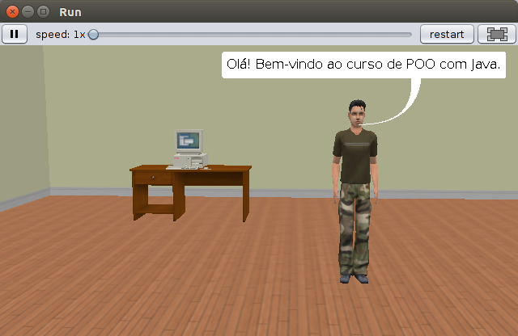
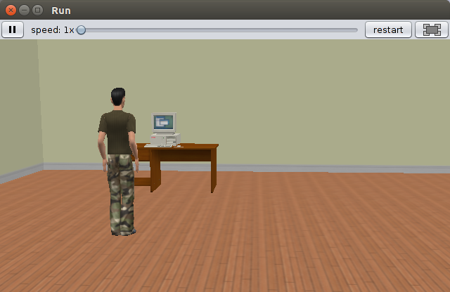
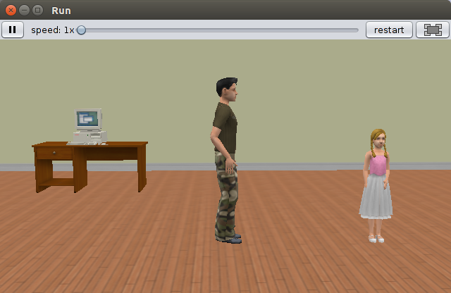
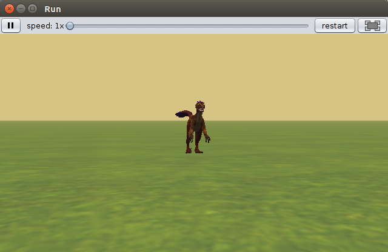
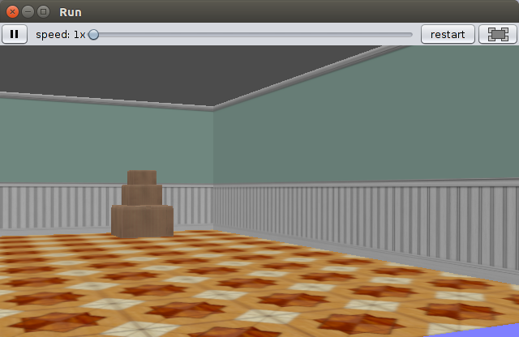
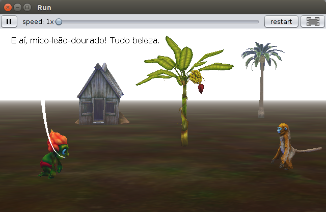

# Projetos - Linguagem Alice

  

Este repositório será utilizado para organizar um conjunto de projetos desenvolvidos na ferramenta Alice.

  
<b>🛠️ Projeto: Hello World:</b>

   
  

    
  

  
<b>🛠️ Projeto: Apresentação UFLA:</b>

   
  

    
  

  
<b>🛠️ Projeto: Fundo do Mar:</b>

   
  

    
  

  
<b>🛠️ Projeto: Mundo Marinho:</b>

   
  

    
  

## Exemplos de Alguns Projetos em Alice

A seguir são listados alguns exemplos de projetos utilizando a ferramenta Alice. Estes projetos são encontrados dentro da pasta [[`projects`](./projects/)].

| Nome Arquivo Local                        | Conceitos Trabalhados                                                                                  | Imagem                                          |
|-------------------------------------------|--------------------------------------------------------------------------------------------------------|-------------------------------------------------|
| project-hello-world.a3p		            | Animação, inserção de objetos, personagens e métodos simples                                           |   |
| project-estudar-java.a3p                  | Animação, inserção de objetos, personagens e métodos mais elaborados                                   |  |
| project-dancinha-alice.a3p		        | Animação, inserção de objetos, personagens e métodos com algumas estruturas de controle                |         |
| project-game.a3p          				| Jogo, interação com personagem através de eventos de teclado, mouse e tempo                            |               |
| project-sp-robo.a3p                       | Animação, inserção de objetos, movimentação da câmera                                                  |       |
| project-roteiro-aula-pratica.a3p          | Animação, inserção de objetos e personagens, criação de diálogos, estruturas de controle, propriedades |  |

## Alguns Vídeos de Projetos em Alice

A seguir tem-se alguns vídeos que ilustram as animações 3D desenvolvidas na ferramenta Alice. Estes vídeos também se encontram dentro da pasta [[`videos`](./videos/)].

* 
* 
* 
